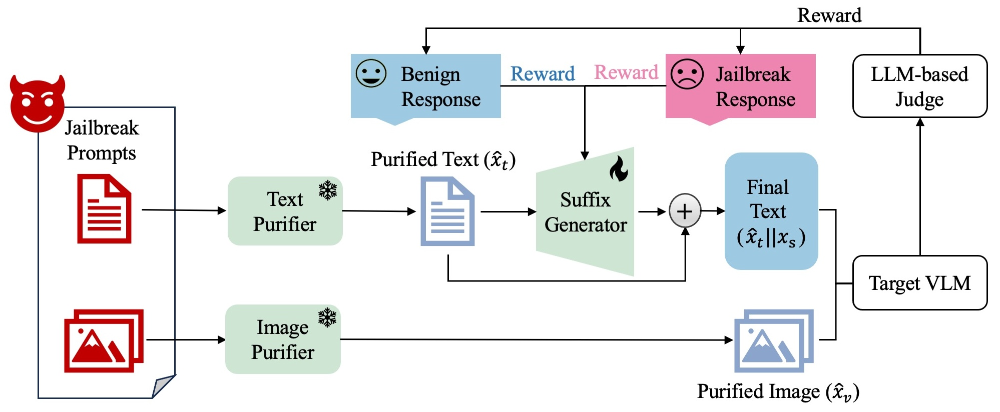

#  BlueSuffix


Code for Papar ["BlueSuffix: Reinforced Blue Teaming for Vision-Language Models Against Jailbreak Attacks"](https://arxiv.org/abs/2410.20971). 

We currently provide code for the three components of BlueSuffix. For fine-tuned Suffix Generator, we will provide it in the future.

*Abstract*

Despite their superb multimodal capabilities, Vision-Language Models (VLMs) have been shown to be vulnerable to jailbreak attacks, which are inference-time attacks that induce the model to output harmful responses with tricky prompts. It is thus essential to defend VLMs against potential jailbreaks for their trustworthy deployment in real-world applications. In this work, we focus on black-box defense for VLMs against jailbreak attacks. Existing black-box defense methods are either unimodal or bimodal. Unimodal methods enhance either the vision or language module of the VLM, while bimodal methods robustify the model through text-image representation realignment. However, these methods suffer from two limitations: 1) they fail to fully exploit the cross-modal information, or 2) they degrade the model performance on benign inputs. To address these limitations, we propose a novel blue-team method **BlueSuffix** that defends the black-box target VLM against jailbreak attacks without compromising its performance. **BlueSuffix** includes three key components: 1) a visual purifier against jailbreak images, 2) a textual purifier against jailbreak texts, and 3) a blue-team suffix generator fine-tuned via reinforcement learning for enhancing cross-modal robustness. We empirically show on three VLMs (LLaVA, MiniGPT-4, and Gemini) and two safety benchmarks (MM-SafetyBench and RedTeam-2K) that **BlueSuffix** outperforms the baseline defenses by a significant margin. Our **BlueSuffix** opens up a promising direction for defending VLMs against jailbreak attacks.



# Usage

## Requirements

Python 3.11.5

```
pip install -r requirements.txt
```

## Model depolyment

Please following the offcial guidelines.

[1]LLaVA: https://github.com/haotian-liu/LLaVA

[2]MiniGPT: https://github.com/Vision-CAIR/MiniGPT-4

## Image Purifier

```
cd Image_Purifier

python image_purifier.py --config diffpure.yml --log_dir path/to/your/fold
```
The code of Image Purifier is based on [DiffPure](https://github.com/NVlabs/DiffPure).

## Text Purifier

```
python text_purifier.py
```
The Text Purifier needs to call the GPT API.

## Suffix Generator
Before fine-tuning, deploying target VLM is needed.

```
python ppo_blue_team.py
```

## Citing BlueSuffix
🌟 If you find it helpful, please consider starring this repository and cite our research:
```tex
@article{zhao2024bluesuffix,
  title={BlueSuffix: Reinforced Blue Teaming for Vision-Language Models Against Jailbreak Attacks},
  author={Zhao, Yunhan and Zheng, Xiang and Luo, Lin and Li, Yige and Ma, Xingjun and Jiang, Yu-Gang},
  journal={arXiv preprint arXiv:2410.20971},
  year={2024}
}
```
In case of any questions, bugs, or suggestions, please feel free to open an issue.
